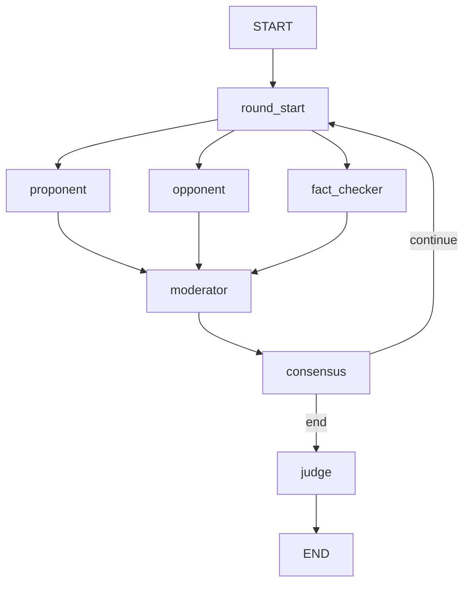
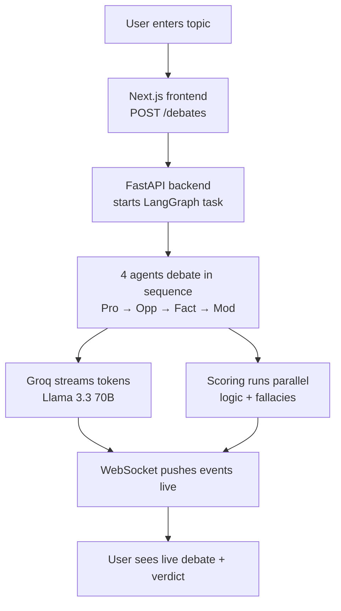

<div align="center">

# ⚔ WARROOM

### Multi-Agent AI Debate Arena

*Tell it anything. Four AI agents debate it. A judge gives you a verdict.*

[](https://warroom-frontend.vercel.app)
[](https://warroom-1.onrender.com/health)
[](https://github.com/harshitayadavv/warroom)


</div>

---

## 🔗 Live Links

| Service | URL | Status |
|---|---|---|
| 🌐 **Frontend** | [warroom-frontend.vercel.app](https://warroom-frontend.vercel.app) |  |
| ⚙️ **Backend API** | [warroom-1.onrender.com](https://warroom-1.onrender.com) |  |
| 📡 **Health Check** | [/health](https://warroom-1.onrender.com/health) |  |

> **Note:** Backend runs on Render free tier — first load may take 30–50s to wake up (cold start).

---

## What it does

You type any topic. Four AI agents take over and debate it in real time:

| Agent | Name | Role |
|---|---|---|
| ▲ **Proponent** | AXIOM | Argues as strongly as possible *for* your topic |
| ▼ **Opponent** | REFUTE | Finds every weakness and argues *against* |
| ◆ **Fact-Checker** | VERITAS | Neutral auditor — detects fallacies, verifies claims |
| ◉ **Judge** | ARBITER | Scores every turn, delivers a final verdict |

### Works for any topic

```
🐕  "Should I buy a dog?"
💼  "Should I quit my job and freelance?"
🏠  "Should I rent or buy a house right now?"
⚡  "Nuclear energy is essential for net-zero"
🤖  "AI development should be paused immediately"
🌍  "Social media does more harm than good"
```

---

## ✨ Key Features

- **⚡ Real-time streaming** — Every agent's response streams token-by-token via WebSocket. Watch agents think and speak live.
- **⏸ Pause & interrupt** — Pause any debate mid-turn. Inject evidence, challenge a claim, or redirect the conversation.
- **🔍 Live web search** — Fact-Checker uses Tavily to search the web in real time, verifying claims as they're made.
- **⚠ Fallacy detection** — Every turn scanned for 10+ fallacy types (Ad Hominem, Straw Man, False Dichotomy, etc.).
- **📊 Live metrics** — Animated score bars, head-to-head battle view, and consensus arc update after every turn.
- **🧬 Consensus engine** — Vector embeddings measure stance convergence. Debate ends when agents agree enough.
- **⏱ Time-travel & forking** — Every round checkpointed. Jump back and fork a new debate branch from any point.
- **🏆 Judge verdict** — Full verdict with winner, key arguments, fallacy summary, and concrete recommendation.
- **👤 Personal topic support** — Detects personal decisions and adjusts agents to discuss practical, real-world impact.

---

## Tech Stack

<table>
<tr>
<td valign="top" width="50%">

**Frontend**
- Next.js 14 (App Router) + TypeScript
- Pure CSS custom properties
- WebSocket real-time streaming
- Supabase Auth
- Deployed on **Vercel**

</td>
<td valign="top" width="50%">

**Backend**
- FastAPI + Python
- LangGraph state machine
- Groq API (Llama 3.3 70B)
- Supabase (PostgreSQL + Auth)
- Redis (pause/interrupt state)
- Deployed on **Render**

</td>
</tr>
</table>

---

## Architecture

### LangGraph State Machine


### How it works

`` `
---

## Project Structure

```
WarRoom/
├── frontend/                  # Next.js app
│   ├── app/
│   │   ├── page.tsx           # Landing page
│   │   ├── auth/              # Login + Signup
│   │   ├── debate/
│   │   │   ├── new/           # Create debate form
│   │   │   └── [id]/          # Live debate arena
│   │   └── history/           # Past debates
│   ├── components/
│   │   ├── agents/            # AgentCard
│   │   ├── dashboard/         # LiveMetricsPanel, ConsensusGauge
│   │   ├── debate/            # DebateFeed, InterruptModal, DebateControls
│   │   ├── graph/             # GraphCanvas (React Flow)
│   │   ├── timeline/          # DebateTimeline, ForkModal
│   │   └── ui/                # Button, Badge, Tooltip
│   ├── hooks/
│   │   ├── useAuth.ts         # Supabase session
│   │   ├── useDebate.ts       # Debate state + WS events
│   │   └── useCheckpoints.ts  # Time-travel / fork
│   └── lib/
│       ├── api.ts             # FastAPI client
│       ├── supabase.ts        # Supabase client
│       ├── types.ts           # TypeScript interfaces
│       └── constants.ts       # Shared constants
│
└── backend/                   # FastAPI app
    ├── main.py                # Entry point + CORS
    ├── models/schemas.py      # Pydantic models
    ├── routers/
    │   ├── debates.py         # REST endpoints
    │   └── ws.py              # WebSocket manager
    ├── agents/
    │   ├── graph.py           # LangGraph state machine
    │   ├── consensus.py       # Vector embedding engine
    │   ├── prompts.py         # System prompts
    │   └── scoring.py         # Per-turn scoring
    └── services/
        ├── groq_client.py     # Groq API
        ├── supabase_client.py # DB operations
        └── redis_client.py    # Ephemeral state
```

---

## Getting Started

### Prerequisites

- Node.js 18+
- Python 3.11+
- [Supabase](https://supabase.com) project (free)
- [Groq](https://console.groq.com) API key (free)
- [Tavily](https://tavily.com) API key (optional — enables web search)

---

### 1. Clone the repo

```bash
git clone https://github.com/harshitayadavv/warroom.git
cd warroom
```

### 2. Database setup

1. Go to your Supabase project → **SQL Editor** → **New query**
2. Paste the contents of `backend/supabase_schema.sql`
3. Click **Run**

### 3. Frontend

```bash
cd frontend
npm install
```

Create `frontend/.env.local`:
```env
NEXT_PUBLIC_SUPABASE_URL=https://your-project.supabase.co
NEXT_PUBLIC_SUPABASE_ANON_KEY=your-anon-key
NEXT_PUBLIC_API_URL=http://localhost:8000
```

```bash
npm run dev   # http://localhost:3000
```

### 4. Backend

```bash
cd backend
python -m venv venv
source venv/bin/activate   # Windows: venv\Scripts\activate
pip install -r requirements.txt
```

Create `backend/.env`:
```env
GROQ_API_KEY=gsk_your_key
SUPABASE_URL=https://your-project.supabase.co
SUPABASE_SERVICE_KEY=your-service-role-key
REDIS_URL=redis://localhost:6379
TAVILY_API_KEY=tvly-your-key
CORS_ORIGINS=http://localhost:3000,https://warroom-frontend.vercel.app
DEBUG=true
```

```bash
uvicorn main:app --reload --port 8000   # http://localhost:8000
```

---

## Deployment

### Frontend → Vercel

| Variable | Value |
|---|---|
| `NEXT_PUBLIC_API_URL` | `https://warroom-1.onrender.com` |
| `NEXT_PUBLIC_SUPABASE_URL` | Your Supabase URL |
| `NEXT_PUBLIC_SUPABASE_ANON_KEY` | Your anon key |

### Backend → Render

| Variable | Value |
|---|---|
| `GROQ_API_KEY` | Your Groq key |
| `SUPABASE_URL` | Your Supabase URL |
| `SUPABASE_SERVICE_KEY` | Your service role key |
| `CORS_ORIGINS` | `http://localhost:3000,https://warroom-frontend.vercel.app` |
| `TAVILY_API_KEY` | Your Tavily key (optional) |

Start command: `uvicorn main:app --host 0.0.0.0 --port 8000`

---

## Groq Models

| Agent | Model |
|---|---|
| Proponent, Opponent, Judge | `llama-3.3-70b-versatile` |
| Fact-Checker | `llama-3.3-70b-versatile` |
| Scoring | `gemma2-9b-it` (separate quota) |

---

## License

MIT — do whatever you want with it.

---

<div align="center">

Built with ⚔ by [Harshita Yadav](https://github.com/harshitayadavv)

[](https://vercel.com/new/clone?repository-url=https://github.com/harshitayadavv/warroom)

</div>
